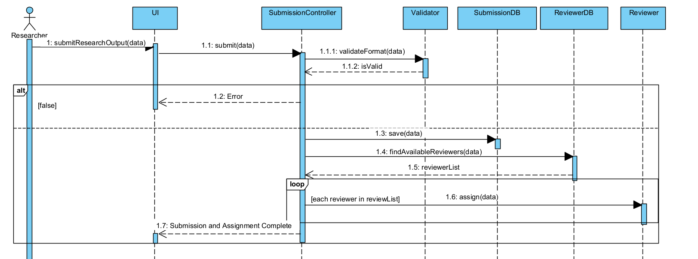
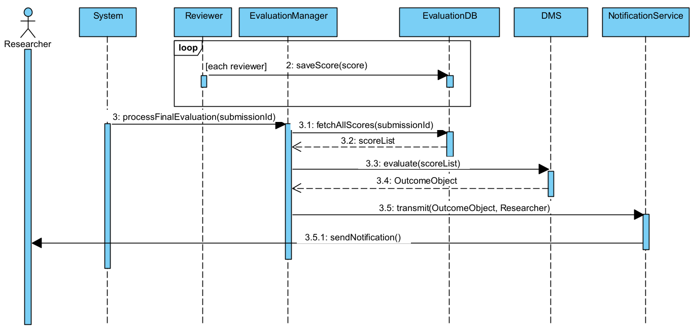

# Software-Eng-I-Assignment-2-Architectural-Refactoring-Optimization
This project involved the comprehensive architectural analysis and refactoring of a monolithic, tightly coupled Java-based submission and evaluation system.

> **An architectural analysis and refactoring project demonstrating the transition from a tightly coupled procedural monolith to a highly cohesive application.**

## Project Overview
This project involves the audit, redesign, and empirical benchmarking of a Java-based academic submission.

This project demonstrates the complete end-to-end refactoring of an "Intelligent Submission and Review System." The primary objective was to translate a flawed behavioural model into a baseline implementation, critically evaluate its inefficiencies, and re-implement a highly optimized, decoupled architecture. The resulting optimized system achieved a **77.5% reduction in computational latency** and a **44% reduction in method call overhead**.

### Please note that this is an **architectural proof-of-concept and mock implementation** designed specifically to evaluate backend design patterns (S.O.L.I.D. and GRASP). 
**No External UI/Database:** The system does not connect to a physical relational database or a web-based frontend. Data is persisted using simulated, in-memory Java objects.
**Simulated Asynchrony:** To benchmark the decoupled evaluation lifecycle without requiring real human reviewers to log in days later, the system utilizes a mock test stub (`simulateScoreSubmission()`). This programmatically replicates the passage of time and asynchronous data entry.

---
### Decoupled Execution Flow
#### Phase 1: The Submission Sequence
The boundary controller now handles validation and assignment, delegating data persistence to the Information Expert (`SubmissionDB` and `ReviewerDB`) before terminating its lifecycle.



#### Phase 2: The Evaluation Sequence
Triggered asynchronously by the `SystemScheduler`, this phase uses the `DMS` (Decision Management System) to evaluate scores and dispatches an outcome to the `NotificationService`.


---

## Benchmarks (Before vs. After)
The architectural refactoring was verified using a custom `MetricTracker`, benchmarking 1000 execution impact:

| Metric | Task 1 (Baseline) | Task 5 (Optimised) | Empirical Impact |
| :--- | :--- | :--- | :--- |
| **Total Method Invocations (1 run)** | 27 Calls | 15 Calls | **44% computational overhead difference** |
| **Execution Latency (1k runs)** | 9060.01 ms | 2041.98 ms | **77.5% execution speedup** |
---
## Compilation & Execution
---
### 1. Verify Java Installation
You must have the Java Development Kit (JDK) installed before compiling or running code. Check your installation by running:
```bash
java -version
```
* **Success:** The terminal will display your installed Java version number.
* **Failure:** A "command not found" error means you must install the JDK first.

### 2. Navigate to Your Project Directory
Your terminal must look inside the specific folder where the source files live (tasks 1 & 5). Use the Change Directory command:
```bash
cd task1-baseline
```
* **Shortcut:** Type `cd ` and drag-and-drop the project folder directly into the terminal window.
* **Verification:** Type `ls` (Powershell/Linux/Mac) or `dir` (Windows) to ensure your `.java` files are visible.

### 3. Compile the Source Code
Convert your human-readable Java files into machine-readable bytecode:
```bash
javac *.java
```
* **Bulk Compile:** Use `javac *.java` to compile every Java file in the folder at the same time.
* **Result:** This process generates matching `.class` files in your directory.

### 4. Run the Application
Execute the compiled bytecode using the Java Virtual Machine (JVM):
```bash
java App
```
* **Crucial:** Never include the `.class` file extension in this command.
* **Requirement:** The class you App is the only one that contains a `public static void main(String[] args)` method.

### 5. BenchMark Execution
Uncomment the last lines in both the task's main methods to run the benchmarks:
```java
//UNCOMMNET BENCHMARK CODE BELOW TO RUN IT!
// benchMark(researcher, systemUI, myData);
```
